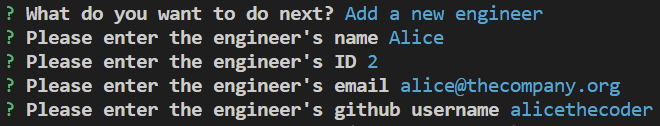

# team-profile-generator

## Description

Create a node app that prompts the user to enter employee details and then write all the entered employees details to a `team.html` file.

The app will prompt you for your manager details and then allow you to add your engineers and interns. For each employee you are prompted to enter their name, ID and email. The manager also requires their office number, the engineer requires their github account and the intern requires their school.

Further work to be done includes:
- finish testing of `src\fs-helpers.js`.
- move `Inquirer` interactions to their own module and add tests.
- add tests for logic in `index.js`.
- change employee and it's sub-classes to use getters rather than `get*()` methods.
- add employee details validation.
- add more styling to the HTML output.

## Installation

Save the files in this repo to a local folder.

## Usage

Once you have a local copy of this repo, navigate to the install folder in your favourite shell and run `node .\index.js`.

Follow the prompts to enter your manager.

Select your next action.

Add you engineers.

Add your interns.

When you have added all of your engineers and interns, select `Finish building your team`. Your team will be built into an HTML file located `.\output\team.html`.

Please be sure to save this file to a different location before running the app again as the output file will be overwritten.

## License

Please see the license file in the repo.